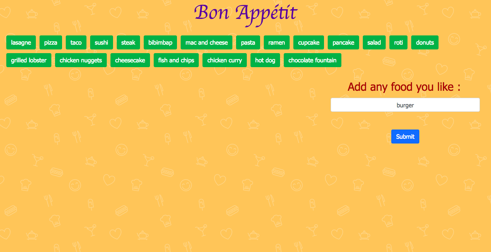

# Laura-Lee-Portfolio
Laura Lee Portfolio


# Link to deployed site
https://lalatw.github.io/Laura-Lee-Portfolio/


# Images
 

# Technology used
* html
* css
* bootstrap
* JS


# Code snippets


```
    <!-- SLIDSHOW -->
    <section class="slideshow">
        <ul>
        <li>
            <figure>
                <figcaption>
                    <h3>Gif Tastic</h3>
                    <hr/>
                    <p>The program calls the GIPHY API and use JavaScript and jQuery to change the HTML of the site.</p>
                    <span class="detail-span">Websites:</span> <a href="https://lalatw.github.io/GifTastic/" target="_blank" ><span class="dc-span">https://lalatw.github.io/GifTastic/</span></a><br>
                    <span class="detail-span">Github:</span><a href="https://github.com/lalatw/GifTastic" target="_blank" ><span class="dc-span">https://github.com/lalatw/GifTastic</span></a>
                </figcaption>
                
                
            </figure>
        </li>
        <li>
            <figure>
                <figcaption>
                    <h3>Gif Tastic</h3>
                    <hr/>
                    <p>The program has a form that takes the value from a user input box and adds it into array.</p>
                    <span class="detail-span">Websites:</span> <a href="https://lalatw.github.io/GifTastic/" target="_blank" ><span class="dc-span">https://lalatw.github.io/GifTastic/</span></a><br>
                    <span class="detail-span">Github:</span><a href="https://github.com/lalatw/GifTastic" target="_blank" ><span class="dc-span">https://github.com/lalatw/GifTastic</span></a>
                </figcaption>
                
            </figure>
        </li>
        <li>
            <figure>
                <figcaption>
                    <h3>Gif Tastic</h3>
                    <hr/>
                    <p>The program has a function to take each topic in the array and display on the page. When the user clicks one of the still GIPHY images, the gif will animate. If the user clicks the gif again, it will stop playing.</p>
                    <span class="detail-span">Websites:</span> <a href="https://lalatw.github.io/GifTastic/" target="_blank" ><span class="dc-span">https://lalatw.github.io/GifTastic/</span></a><br>
                    <span class="detail-span">Github:</span><a href="https://github.com/lalatw/GifTastic" target="_blank" ><span class="dc-span">https://github.com/lalatw/GifTastic</span></a>
                </figcaption>
                
            </figure>
        </li>
        </ul>
        <nav>
        <span class="nav-prev fa-chevron-left fa fa-2x "></span>
        <span class="nav-next fa-chevron-right fa fa-2x"></span>
        <span class="close nav-close"><i class="fa fa-times"></i></span>
        </nav>
    </section>


```


# Learning points
* Apply all HTML, CSS, JS, Styling library and template to modify personal porfolio and make the info up to date. 


# Author 
[Shuhan Laura Lee](https://lalatw.github.io/Laura-Lee-Portfolio/)


# License
Standard MIT License
